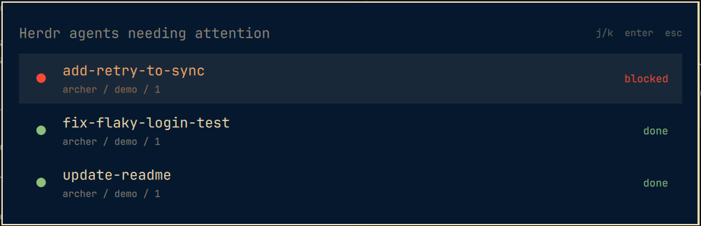
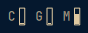

# my-omarchy

My [Omarchy](https://github.com/basecamp/omarchy) bar widgets and shell plugins. The layout mirrors `~/.config/omarchy/`, so a file at `plugins/gil.herdr/Panel.qml` here lives at `~/.config/omarchy/plugins/gil.herdr/Panel.qml` on the machine.

Built against Omarchy 4.0.4 (Hyprland 0.56).

## Install

Copy what you want into place, then restart the shell:

```bash
cp -a plugins/<id> ~/.config/omarchy/plugins/
cp -a bar/modules/<name>.qml ~/.config/omarchy/bar/modules/
cp -a bar/scripts/<name> ~/.config/omarchy/bar/scripts/
omarchy restart shell
```

Hot reload doesn't re-instantiate a running widget, so code changes always need `omarchy restart shell`.

## Own widgets

### gil.herdr

herdr agents that need attention (blocked or done).




- **Bar widget**: herdr's sidebar dot with the count inside, red if any agent is blocked, teal if only done, a hollow ring in the bar foreground at 0. The panel lists the agents (`j`/`k`, Enter, or click) and jumps to the pane: `herdr agent focus`, then raises the terminal window whose process tree holds the herdr client for that server.
- **Overlay**: the same list centered at the Omarchy menu's size (its `[menu]` surface, row, and font tokens). Up/Down or `j`/`k`, Enter jumps, Esc closes. `omarchy-shell shell toggle gil.herdr` opens it.
- **Service**: `Service.qml` runs a single `herdr-attention watch`; the bar widget and the overlay read from it (`shell.serviceFor("gil.herdr")`).

It covers the local herdr server and every running `herdr --remote <target>` client, each over one long-lived ssh that streams `herdr api snapshot`, so a poll never pays for an ssh handshake. Colors are herdr's gruvbox palette, hardcoded. Window focus uses the Lua `hl.dsp.focus` dispatch (Hyprland 0.56), falling back to `focuswindow`. It's a plugin rather than a `qml` module so it can use the shared panel; `keepLoaded` keeps the service running.

Setup after copying:

```bash
omarchy plugin enable gil.herdr --section right
```

Optional keybinding, in `~/.config/hypr/bindings.lua`:

```lua
o.bind("SUPER + H", "Herdr agents", "omarchy-shell shell toggle gil.herdr")
```

Optional Omarchy menu entry (SUPER+SPACE, search "herdr agents"): a `trigger.herdr-agents` entry in `~/.config/omarchy/extensions/omarchy-menu.jsonc` whose action is `omarchy-shell shell summon gil.herdr '{}'`.

### sysmeter

`bar/modules/sysmeter.qml` and `bar/scripts/sysmeter`: three tiny vertical meters for CPU, GPU and memory (C, G, M). Memory is (MemTotal - MemAvailable) / MemTotal. Add it to a bar section in `~/.config/omarchy/shell.json` as `{ "id": "sysmeter", "type": "qml" }`.



## Cloned plugins

Made with `omarchy plugin clone <id>`, which copies a packaged widget into `~/.config/omarchy/plugins/<user>.<name>/` and points the bar at the copy. A clone no longer gets upstream fixes, so they're merged by hand. The originals are Omarchy's (MIT, Copyright (c) David Heinemeier Hansson / 37signals).

| Clone | Cloned from | Upstream source | Base version | What changed |
| --- | --- | --- | --- | --- |
| `gil.workspaces` | `omarchy.workspaces` | `shell/plugins/bar/widgets/Workspaces.qml` | 4.0.4-1 | The focused-workspace marker follows the workspace active on *this bar's* monitor (`Hyprland.monitorFor(QsWindow.window.screen).activeWorkspace`), not the globally focused one, so each monitor's bar is right. Adds `import Quickshell`. |
| `gil.tray` | `omarchy.tray` | `shell/plugins/bar/widgets/Tray.qml`, `TrayModel.js` (unchanged) | 4.0.4-1 | New `maxVisible` setting (default 6, 0 = unlimited): pinned icons, then the rest in tray order, show inline up to that count; only the overflow goes behind the caret, and the caret is hidden when nothing overflows. Middle-click on an icon opens the Pin/Hide popup while the caret is hidden. `moduleName` is `gil.tray`, and `persistTrayState` keeps the entry's other settings (so pin/hide doesn't drop `maxVisible`). |

To use a clone, point the bar entry in `~/.config/omarchy/shell.json` at its id (`gil.workspaces`, `gil.tray`) instead of the `omarchy.*` one.

`gil.workspaces`:


`gil.tray`:


### Merging an Omarchy update

3-way: old upstream = base, new upstream = theirs, clone = ours.

1. Get the base from the package cache: `bsdtar -xOf /var/cache/pacman/pkg/omarchy-<base>-x86_64.pkg.tar.zst usr/share/omarchy/<upstream source>`. If `paccache` removed it, use the `v<base>` tag of https://github.com/basecamp/omarchy (repo path without `usr/share/omarchy/`).
2. `diff -u base new` to see what upstream changed; if nothing, the clone needs nothing.
3. Merge with `git merge-file <clone> <base> <new>`, resolve conflicts, keep the clone's `moduleName` and its own changes.
4. Check the manifest too (`*.manifest.json` vs the clone's `manifest.json`): keep `id`, `name` and `clonedFrom`, take anything else new.
5. `omarchy restart shell`, check the bar, then update the base version in the table above.
